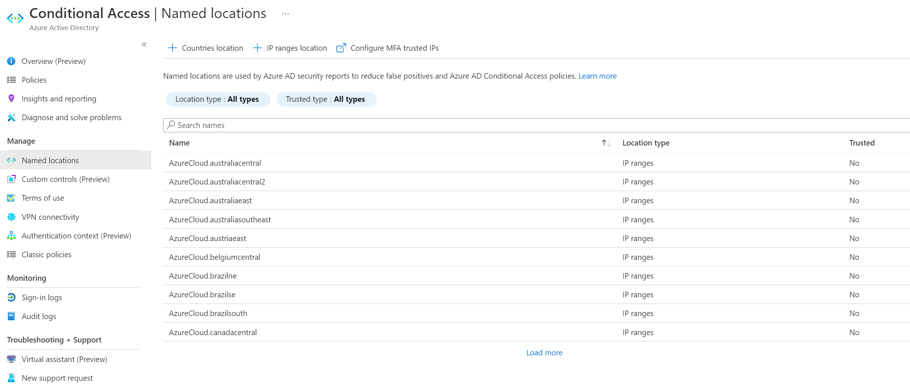
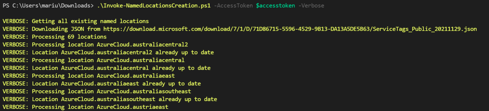

# Script to create named locations

The **Invoke-NamedLocationsCreation.ps1** script consumes the Microsoft managed JSON file found [here](https://www.microsoft.com/en-us/download/confirmation.aspx?id=56519), creating named locations in Azure AD, for use with conditional access:



## Usage

The script requires an access token with the Graph scope 'Policy.ReadWrite.ConditionalAccess'

```PowerShell
$AccessToken = "...." # Get from graph.microsoft.io
.\Invoke-NamedLocationsCreation.ps1 -AccessToken $AccessToken -Verbose -WhatIf
```

